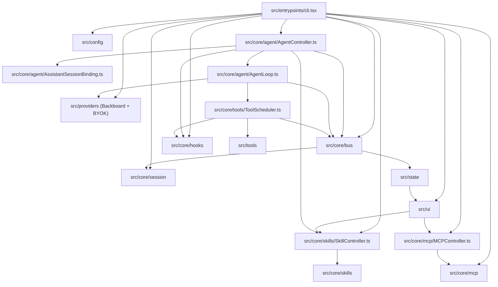
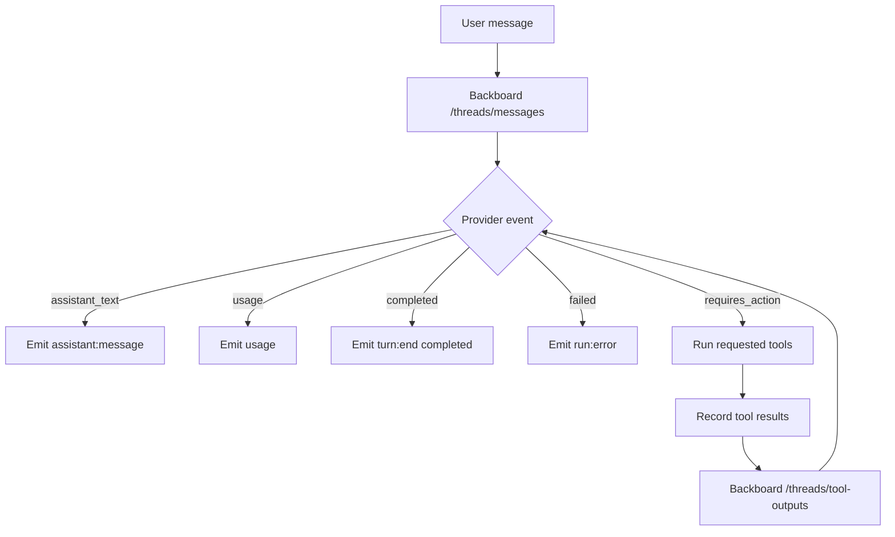

# Backboard R-CLI Architecture

Backboard R-CLI is a Bun and TypeScript terminal coding agent.

It is built around a simple rule:

> Core logic emits events. UI, logs, and output modes subscribe to those events.

This keeps the agent loop, tools, provider API, and terminal UI separate.

## Big Picture



## Source Layout

`src/entrypoints/`

The process entrypoint. It should stay thin. It reads config, creates runtime objects, starts the UI or headless mode, and flushes logs before exit.

`src/config/`

Environment variables, CLI flags, defaults, profiles, and runtime path layout. Model, memory, profile, thinking, output format, tool filtering decisions, and Backboard R-CLI-owned config path construction live here.

`src/core/bus/`

The typed event system. `AgentEvent` is the shared language between the agent loop, tools, UI, and logs.

`src/core/agent/`

Turn orchestration. This code binds the stable Backboard assistant, builds per-turn prompt/tool overrides, sends user input to Backboard, handles provider events, runs tools when needed, submits tool outputs, and handles cancellation.

`src/core/session/`

Runtime session state and durable logs. It stores the assistant binding, thread id, transcript, usage, todos, and JSONL logs under `.backboard/sessions/<session-id>/`. `SessionLifecycle` owns the active local session identity. `/new` and remote-thread resume rotate it to a fresh directory; resuming a local BYOK thread restores the identity saved with that conversation. Client/server log writers, JSON event ids, hook context, checkpoint journals, and compaction transcript paths rotate with the same identity.

`src/core/checkpoints/`

Per-session pre-image journals for `/undo`, `/redo`, and `/rewind`. `CheckpointManager` is the stable facade held by tools and UI. It swaps the underlying `CheckpointStore` when a local conversation is resumed, so checkpoint history follows the conversation across process restarts. Content-addressed blobs remain shared at the workspace session root, and abandoned restore recovery keeps using the workspace-level `pending-undo.json` pointer.

`src/core/skills/`

Skill discovery, validation, catalog budgeting, skills.sh listing/import, and activation. Local skills use `.agents/skills/<name>/SKILL.md`; discovery runs only after the user invokes `/skills`. The picker has Repo, Personal, and skills.sh tabs with current-tab search; Personal also shows repo skills marked `active`. The skills.sh tab reads public leaderboard pages and caches them in-process. Remote skills are imported with the official `npx skills add ...` flow, normalized into `.agents/skills`, and then loaded. Only selected skills enter the compact catalog, and full skill bodies are added only for explicit `$skill-name` activation. Bundled support files are listed relative to the skill directory so the agent can read them only when needed.

`src/core/mcp/`

MCP config loading, `/mcp` manager orchestration, curated catalog entries, manual config writing, environment expansion, source-aware disable/remove, server connection management, notification-driven tool refresh, and MCP tool-name generation. `McpController` owns catalog/manual add workflows for the Ink UI. This module owns MCP transport details and returns tool definitions that `src/tools/MCPToolAdapter.tsx` wraps as normal Backboard R-CLI tools.

`src/core/hooks/`

Command hook config loading, project-hook trust checks, hook hashing, command execution, hook manager summaries and writes, and hook event orchestration. `HookController` is called by `AgentController` for session and prompt hooks, and by `ToolScheduler` for pre/post tool hooks. `HookManagerController` owns the `/hooks` UI data for listing events, matchers, and hook details, and for adding/removing hooks.

`src/core/tools/`

Generic tool infrastructure. It owns the tool base class, registry, Zod-to-JSON-schema conversion, tool execution context, and scheduling rules.

`src/core/permissions/`

The gate between a scheduled tool call and its execution. `PermissionEngine` resolves a mode plus a rule set into allow/deny/prompt; `PermissionPrompter` drives the interactive prompt. Command classification lives in `dangerousCommands.ts` and `safeCommands.ts`, and `pathsInside.ts` decides whether a path is inside the workspace. See "Permissions" below.

`src/core/lsp/`

Optional language-server diagnostics, enabled per run with `--lsp` or per session with `/lsp`. `lsp-servers.json` is the single source of truth for server ids, binaries, and npm packages; the runtime registry and the eval provisioning scripts both read it rather than hardcoding the triples. Servers are resolved from PATH or installed into a cache dir on demand.

`src/core/auth/` and `src/core/oauth/`

Backboard OAuth device-authorization login, token handling, and the saved auth session. `LoopbackOAuth.ts` is the generic localhost-redirect helper shared with MCP server OAuth.

`src/core/browser/` and `src/core/computer/`

Runtimes behind the `Browser` and `Computer` tools, enabled per session with `/browser` and `/cua`. Browser drives a Chromium tab over Chrome DevTools, connecting to an existing endpoint when one is discoverable and otherwise launching a temporary profile; it closes only the browsers it launched. Computer captures local screenshots and synthesizes input through the `src/core/platform/` abstraction.

`src/core/attachments/`, `src/core/todos/`, `src/core/update/`, `src/core/platform/`, `src/core/image/`

Supporting services: file/clipboard-image attachments, the todo list projected by `TodoWrite`, the `/update` version check, OS-specific process and screenshot primitives, and image encoding shared by the vision paths.

`src/providers/`

`AgentClient.ts` is the model-backend contract every consumer above it depends on: stream a turn, stream a tool-output continuation, list models, and declare capabilities (`assistants`, `threads`, `memory`). Two backends implement it, and `ClientRouter` composes them.

`ClientRouter` decides which backend serves a request. A saved provider key always wins over a Backboard sign-in for the same vendor, so adding a key moves those models onto the user's own billing. Requests naming an existing thread route by that thread's origin (`byok_` prefix) instead, so a mid-conversation key toggle can never split one thread across two backends. `createAgentClient.ts` builds the router from whatever credentials exist, reading them at call time so `/keys` and `/login` take effect without a restart.

`src/providers/backboard/`

Backboard REST transport and response mapping. Provider-specific API shapes should stay here. Backboard holds threads, assistants, and memory server-side, so it declares all three capabilities.

`src/providers/byok/`

Direct vendor APIs for bring-your-own-key runs. Prompt caching is explicit here where the vendor requires it: the Anthropic adapter places breakpoints on the tool block, the system prefix, and a rolling one on the newest message, because a tool loop resends the whole growing history on every leg and without them all of it bills at full input price. OpenAI caches on the prefix automatically and is given a per-conversation cache key so a thread keeps landing on the same shard; Gemini caches implicitly. Note that Anthropic reports `input_tokens` as uncached input only - the adapter adds the cached portions back, or context accounting would under-report a well-cached conversation by an order of magnitude. `ByokClient` keeps active conversations in-process under locally minted thread ids and persists top-level user conversations through `ByokConversationStore`. The versioned `conversation.json` lives beside that conversation's logs and checkpoint journal; writes use a per-session lock, revision check, and thread-ownership guard so concurrent CLIs or stale lifecycle state cannot silently replace history. Stored roots are canonicalized from the discovered session directory, so moving a project preserves resume. Failed stream attempts are transactional, interrupted trailing tool calls are repaired on load, and storage failures warn without converting an otherwise successful model turn into a failure. Helper requests from sub-agents, RLM, and compaction omit the durable-session marker and remain ephemeral. Each adapter renders the neutral transcript into its wire format and maps the vendor's stream back to the same `ProviderEvent` values Backboard yields, so the agent loop, tool scheduling, bus, and UI cannot tell the backends apart. Adding a vendor means one adapter plus an entry in `registry.ts`. `googleSchema.ts` narrows tool schemas to the OpenAPI subset Gemini accepts.

`ClientRouter.listThreads()` merges local BYOK conversations with Backboard threads. `getThread()` routes by thread origin, and the existing session hydration path restores messages, tool outputs, TodoWrite state, the saved model, and the matching checkpoint root. Provider keys and auth headers are never part of the conversation record.

Vendors also differ in how thinking is requested, and sending the wrong dialect is a hard 400 rather than a degraded answer: Claude 5 and Opus 4.7+ take `thinking: {type:"adaptive"}` with a sibling `output_config.effort` while older Claudes take `thinking: {type:"enabled", budget_tokens}`; Gemini 3 takes a named `thinkingLevel` (which has no "max") where earlier Gemini takes a `thinkingBudget` in tokens. Which dialect a model speaks is already decided by its entry in `thinking.profiles.ts`, so the adapters read that same rule rather than adding a second model-name test beside it. Gemini 3 additionally signs its function calls and ids them; both the `thoughtSignature` and the id have to survive the round-trip through the transcript, or the next request is rejected outright - and two calls to the *same* tool in one round become impossible to pair with their results, which in practice ends the turn with no answer at all.

`src/core/keys/`

Provider key storage and the `/keys` surface. Keys live in `~/.backboard/keys.json` at mode 0600, separate from `config.json` so secrets stay out of the file that `/model` and `/settings` rewrite constantly. `ProviderKeyController` owns validate-then-save, so a key that never worked is never written. Keys can be disabled without being deleted. Environment variables are deliberately not consulted: a key becomes usable only by being added explicitly.

Secrets are encrypted at rest with AES-256-GCM under a key derived from a machine-and-user identity (`KeyCipher.ts`). The threat model is stated honestly in that file: the derivation input lives on the same machine, so this is obstruction against casual exposure - screen-shares, pasted terminal dumps, synced dotfiles, grep-for-`sk-` - not secrecy against local code running as the user. Only an OS keychain provides that boundary. A file that fails to decrypt is treated as "no key saved" rather than an error, and a legacy plaintext file is rewritten encrypted on the next startup.

`src/core/context/`

Context accounting and compression, shared by both backends.

Occupancy is a level, not a sum: each turn resends the conversation, so the newest prompt size *is* the current usage. `Session` records what the provider reported for the last request, which is the only authoritative number available; the per-segment breakdown in `/context` is locally estimated and rendered as such, because no provider reports one.

`Compactor` turns a conversation into a handoff document and restarts the thread from it. The summarization request goes through the same `AgentClient` as everything else with no thread id, so it lands on a throwaway conversation - identical behaviour whether that means a fresh Backboard thread or a fresh local BYOK one, and requiring no server-side compaction endpoint. The result is delivered as context on the next turn through the same pending-notes channel `/undo` uses. The visible transcript is then cleared and the screen redrawn, so what is on screen matches what the model actually holds - scrollback full of history the model no longer has is the more confusing state. Nothing is lost: the handoff names the absolute path of this run's `client.jsonl`, so a compressed agent can read back into the uncompressed record for an exact error, command, or path the summary did not carry.

The prompt (`compactionPrompt.ts`) optimizes for resumability rather than brevity: identifiers verbatim, decisions with their reasons, and state before history. The newest exchanges are additionally carried word-for-word, because a summary is least trustworthy exactly where it matters most - the turn that was in flight. Three guards keep compression from being destructive: the verbatim tail can never consume more than half the history, its tool output is clamped (loosely, an order of magnitude above the summarized side) so one huge result cannot leave the next prompt no smaller than the last, and a reply that does not carry the document's own structure is rejected rather than allowed to replace the transcript.

Automatic compression fires at 85% of the window and only ever between turns; compressing mid-turn would reset the thread out from under a tool loop still submitting results into it.

`src/tools/`

Concrete tools. Each tool has one file and one clear job.

`src/prompts/`

System prompt and tool prompt modules. Model-facing wording belongs here, not inside the tool executor code.

`src/state/`

Pure UI reducer logic. It converts `AgentEvent` values into `AppState`.

`src/ui/`

Ink and React terminal UI. Components render state and call controller methods. They should not run tools or call Backboard directly.

`src/utils/`

Small generic helpers only.

`tests/`

Bun tests for config, events, logs, mappers, scheduler behavior, MCP catalog behavior, and agent loop behavior.

## Startup Flow

The main startup path begins in `src/entrypoints/cli.tsx`.

1. Parse early commands: `login`, `logout`, `--help`, and `--version`.
2. If `login` was requested, run browser-based Backboard OAuth and save returned credentials.
3. Create `Config`, which resolves credentials into `config.auth`. Either a Backboard sign-in or one enabled provider key is enough to run; only having neither is fatal.
4. If interactive startup has no credentials, render the auth screen: Backboard login, bring-your-own-key, or exit. Login runs browser-based OAuth; BYOK picks a provider, validates a pasted key, and saves it. Either path retries config creation.
5. Create a session id.
6. Create `.backboard/sessions/<session-id>/`.
7. Create `EventBus`.
8. Attach `ClientEventLog`.
9. Attach `JsonEventStream` if `--format json` is enabled.
10. Create `Session`.
11. Create the `AgentClient` for the run (`createAgentClient`).
12. Load hook config and create `HookController` plus `HookManagerController`; untrusted project hooks emit non-fatal warnings.
13. Load MCP config, connect enabled MCP servers, and emit non-fatal warnings.
14. Build the permission context from `--permission-mode` and project
    `settings.json`. `--print` and `--format json` both run headless, where no UI
    can answer an `input:request`, so the gate is told there is nobody to prompt.
    An unknown mode string warns and falls back rather than exiting.
15. Register the default tools, including MCP adapters when MCP tools are available.
16. Build or reuse a Backboard assistant for the current system prompt and tool set.
17. Create `SkillController`.
18. Create `McpController`.
19. Create `SessionLifecycle` and `AgentController`.
20. Run either headless mode or the Ink UI.
21. Close MCP transports and flush client and server logs before exit.

## Interactive Flow

In normal terminal mode, the user talks to `src/ui/App.tsx`.

```mermaid
sequenceDiagram
  participant User
  participant UI as Ink UI
  participant Controller as AgentController
  participant Loop as AgentLoop
  participant Bus as EventBus
  participant Store as UI Store

  User->>UI: Type message
  UI->>Controller: submit(text)
  Controller->>Bus: user:message
  Controller->>Loop: run(text)
  Loop->>Bus: turn:start
  Bus->>Store: reduce event
  Store->>UI: render new state
```

Slash commands are parsed in `src/ui/commands/index.ts`.

Current commands:

- `/help`
- `/model` to pick a model and thinking mode
- `/settings` (alias `/config`) to adjust session preferences
- `/memory` to set persistent memory mode
- `/keys` (alias `/apikeys`) to add, enable, disable, or remove provider API keys
- `/login`, `/logout`
- `/sessions` (aliases `/resume`, `/continue`) to resume a conversation
- `/new` (aliases `/clear`, `/reset`) to start a new thread
- `/quit` (alias `/exit`)
- `/context` to see what is filling the context window
- `/compress` (alias `/compact`) to compress the conversation
- `/undo`, `/redo`, `/rewind` (alias `/checkpoints`) for checkpoint restore
- `/mcp` to manage MCP servers
- `/hooks` to manage command hooks
- `/skills` to open the Repo / Personal / skills.sh picker
- `/discover` to toggle the skill and MCP discovery tools for this session
- `/cua` to enable local computer use for this session
- `/browser` to enable the `Browser` tool for this session
- `/lsp` to toggle language-server diagnostics for this session
- `/verbose` to toggle detailed tool-call output
- `/notify` to toggle a ring when a prompt finishes
- `/update` to check for a newer CLI version
- `/skill-name` for loaded skills

Permission mode is cycled with Shift+Tab rather than a slash command.

## Turn Flow

`AgentController` is the public facade used by the UI for agent turns.

It owns:

- One active turn at a time
- The turn `AbortController`
- Ask-user prompts from tools
- The `ToolScheduler`
- Creation of a fresh `AgentLoop` for each submitted message
- Assistant/session binding for the stable base prompt and tool schemas
- Session and prompt hook execution before a turn reaches Backboard

`SkillController` owns `/skills` discovery, picker state, selected-skill
catalogs, skills.sh imports, and activated skill prompt expansion for turns.

`AssistantSessionBinding` resolves or creates one base Backboard assistant for
the session. Dynamic skills, refreshed MCP tools, and lazy tool prompts stay
local and are sent through Backboard's per-turn `system_prompt` and `tools`
overrides, so the backend thread is preserved when those local capabilities
change.

`AgentLoop` drives one user turn until it reaches a terminal state.



Important turn rules:

- A cancelled turn does not submit partial tool outputs.
- Repeated tool call ids are ignored after they have been answered once in the same turn.
- Tool outputs are submitted only for currently pending tool calls.
- Backboard is the source of truth for thread and run status.
- `SessionStart` hooks run lazily before the first submitted turn; `SessionEnd` only fires if `SessionStart` ran, keeping the pair symmetric.
- `UserPromptSubmit` hooks can block a prompt before it is logged or sent.
- `Stop` hooks run for every turn that started, whatever the outcome, and receive that outcome as `status`.

## Hooks

Hooks are command hooks. Backboard R-CLI does not load JavaScript plugins into the CLI process.

Config files:

- Project: `<repo-root>/.backboard/hooks.json`
- User: `~/.backboard/hooks.json`

User hooks are trusted by default. Project hooks are loaded but skipped unless their computed `sha256:` hash appears in the user config's `trustedProjectHookHashes` list. This keeps shared project config reviewable without silently running new local commands.

Hook events:

- `SessionStart`
- `UserPromptSubmit`
- `PreToolUse`
- `PostToolUse`
- `Stop`
- `SessionEnd`

`Stop` and `SessionEnd` hooks run for side effects only; their output is not fed
back into the turn, and as teardown hooks they are time-bounded so a slow hook
cannot block turn completion or process exit. Matchers only apply to
`PreToolUse`/`PostToolUse`; a matcher on any other event is ignored rather than
silently dropping the hook. A `PreToolUse`/`PostToolUse` hook that matches a tool
forces that tool to run serially, so a broad matcher disables parallel tool
execution.

Hook commands receive one JSON object on stdin. They may print a JSON object on stdout. A non-zero exit code emits a warning; exit code `2` blocks the current prompt or tool with stderr as the reason. Hook processes receive a sanitized environment plus `Q_PROJECT_DIR`, `Q_SESSION_ID`, and `Q_CWD`.

`HookController` runs matching trusted hooks serially. Prompt hooks can block a turn or add model-visible context. Tool hooks run inside `ToolScheduler`; pre-tool hooks can deny execution or replace parsed input, and post-tool hooks see the raw tool output (not Backboard R-CLI's hook-context decoration) and can replace it. Pre- and post-hook context are merged into a single model-visible block.

The `/hooks` command opens an interactive manager in the Ink UI. It lists supported hook events with configured counts, shows matchers and hook details, and supports adding and removing hooks (personal or project) through `HookManagerController`. Users can also edit `hooks.json` directly.

## Event System

The event bus is in `src/core/bus/EventBus.ts`.

The event types are defined in `src/core/bus/events.ts`.

Events are synchronous. This matters because the UI and client log should see the same events in the same order.

Main event groups:

- Session events: `session:created`
- Message events: `user:message`, `assistant:message`, `assistant:delta`
- Turn events: `turn:start`, `turn:end`, `turn:cancelled`
- Tool events: `tool:requested`, `tool:pending`, `tool:start`, `tool:progress`, `tool:result`, `tool:error`, `tool:retracted`
- User input bridge: `input:request`, `input:response`
- State events: `todos:updated`, `usage`, `permission:mode`, `checkpoint:restored`
- System events: `system:warning`
- Error events: `run:error`

Add a new event only when multiple parts of the app need to react to it.

## Session And Logs

Each run creates:

```text
.backboard/sessions/<session-id>/
  client.jsonl
  server.jsonl
  meta.json
  conversation.json
  checkpoints/journal.jsonl
```

`conversation.json` is present only for durable BYOK conversations. Checkpoint
objects are deduplicated under `.backboard/sessions/objects/`.

`client.jsonl`

The local event trace. It records every `AgentEvent`.

`server.jsonl`

The Backboard request and response trace. Sensitive headers are redacted before writing.

`meta.json`

Basic session metadata: session id, creation time, cwd, model, and profile.

Logging rules:

- Never write API keys, auth headers, or session tokens to disk.
- Keep logs ordered.
- Flush logs before exit.
- Keep local logs detailed enough to reconstruct a run.

## Backboard Provider

`src/providers/backboard/BackboardClient.ts` is the only place that should make Backboard HTTP requests.

Current endpoints:

- `POST /threads/messages`
- `POST /threads/tool-outputs`
- `GET /threads?limit=200&include_messages=false`
- `GET /models/providers`
- `GET /models/provider/{provider}`
- `GET /models/thinking-metadata`
- `GET /assistants?limit=200`
- `POST /assistants`

The assistant list is capped at `limit=200` deliberately: the response carries
every assistant's full system prompt, so an uncapped list is megabytes.

`src/providers/backboard/mappers.ts` converts Backboard responses into provider events consumed by `AgentLoop`.

Provider rule:

> Keep Backboard response shape knowledge inside `src/providers/backboard/`.

Do not leak raw Backboard response handling into UI, tools, or the agent scheduler.

## Tools

Concrete tools live in `src/tools/`.

Default tools are registered in `src/tools/index.ts`.

Each tool:

- Extends `Tool<I, O>`
- Has a case-sensitive `name`
- Has a Zod `inputSchema`
- Parses input through the base `Tool`
- Receives a `ToolContext`
- Returns a `ToolResult`

Tool names are part of the model contract. Do not rename them casually.

Current default tools:

- `Read`
- `Write`
- `Edit`
- `ApplyPatch`
- `Execute`
- `Grep`
- `Glob`
- `FetchUrl`
- `WebSearch`
- `AskUser`
- `TodoWrite`
- `Computer`
- `Browser`
- `Agent` (sub-agent delegation; registered only when `createDefaultTools` is given deps)
- `FindSkill` (registered only when a `SkillController` is available)
- `FindMcp` (registered only when an MCP registrar is available)
- `mcp__server__tool` adapters when MCP tools are configured and allowed

`Computer` and `Browser` are registered always but gated behind `/cua` and
`/browser`; the profile's tool policy and `--excluded-tools` decide what is
actually exposed to the model on a given turn.

## MCP

MCP support is explicit and user-triggered in v1.

Config files:

- Project: `<repo-root>/.backboard/mcp.json`
- User: `~/.backboard/mcp.json`

User config wins over project config field-by-field. Config supports stdio servers, Streamable HTTP servers, per-server `timeoutMs`, global `timeoutMs`, `enabledTools`, `disabledTools`, and in-memory `${VAR}` / `${VAR:-fallback}` expansion. Missing variables produce `system:warning` events and do not crash startup.

The `/mcp` command opens a picker titled `Manage MCP servers`. The Ink UI calls `McpController` for curated catalog listing, manual input parsing, project config writes, source-aware disable/remove, and runtime activation. The catalog is checked-in data and does not fetch the official MCP registry or Glama at runtime. New entries are written to project `.backboard/mcp.json`, connected immediately, wrapped as `McpToolAdapter` tools, and registered in the current `ToolRegistry`. Loaded servers retain the project/user config source(s) they came from; disable writes to the highest-precedence source and remove deletes the server from its loaded source file(s). Servers that advertise `tools.listChanged` mark themselves dirty on `notifications/tools/list_changed`; before the next turn, Backboard R-CLI re-lists those servers with paginated `tools/list` calls and syncs added, removed, or changed MCP tools into the shared registry.

MCP tools are wrapped by `McpToolAdapter` and then scheduled like any other tool. Read-only/concurrency behavior comes from MCP annotations:

- `readOnlyHint: true` and not destructive: read-only and concurrency-safe
- `destructiveHint: true`: destructive and serial
- Missing annotations: conservative serial execution

HTTP MCP servers can use browser OAuth through `McpOAuthProvider`, which opens
the system browser, receives the authorization callback through a `localhost`
redirect, and stores MCP OAuth client/tokens under `~/.backboard/mcp-oauth/`
with restrictive file permissions. If the preferred callback port is occupied,
Backboard R-CLI tries the remaining callback port range before registering the OAuth client.
V1 does not include MCP resource tools or SSE transport.

## Tool Scheduling

`ToolScheduler` decides how tool calls run.

Rules:

- Read-only and concurrency-safe calls can run in parallel.
- Write, destructive, or user-interactive calls run alone and in order.
- Calls with matching command hooks run alone and in order because hook commands have no concurrency metadata.
- `PreToolUse` hooks run before each tool call and can deny or rewrite the input.
- `PostToolUse` hooks run after success or failure and can rewrite the model-visible output.
- Unknown tools return an error output instead of crashing the turn.
- Invalid arguments return an error output instead of crashing the turn.
- Cancellation throws `AbortError`.

Tool authors must mark these methods truthfully:

```ts
isReadOnly(input: I): boolean
isConcurrencySafe(input: I): boolean
isDestructive(input: I): boolean
```

The default is conservative: a tool is concurrency-safe only if it is read-only.

## Permissions

`src/core/permissions/` decides whether a scheduled tool call runs, is refused,
or stops to ask the user. It sits between `ToolScheduler` and tool execution, so
every path that runs a tool — including sub-agent tools — goes through it.

Modes, from strictest to loosest:

- `manual` (default): prompt for anything that reads or changes state.
- `acceptEdits`: workspace edits are pre-approved; everything else still prompts.
- `auto`: workspace edits, network reads, and any command off the danger list are
  allowed. Dangerous commands and outward-facing tools (`Browser`, `Computer`,
  mutating MCP) still prompt.
- `bypass`: allow everything. Flag-only.

Shift+Tab cycles `manual` → `acceptEdits` → `auto`. `bypass` is deliberately not
in that cycle and is reachable only through `--permission-mode bypass`; from
`bypass` the cycle exits to the top rather than looping back into it.

Mode and standing rules resolve as `--permission-mode` flag > `settings.json`
mode > `manual`:

```json
{
  "permissions": {
    "mode": "acceptEdits",
    "allow": ["Execute(git status)"],
    "deny": ["Execute(curl:*)"],
    "ask": ["Execute(git push:*)"]
  }
}
```

That file is project-scoped at `<repo-root>/.backboard/settings.json`. A missing
or corrupt file resolves to empty settings rather than an error — permissions
must never make the CLI unstartable.

A rule is `tool` or `tool(pattern)`, matched case-insensitively on the tool name.
A pattern is an exact string, a `prefix:*` prefix match, a path glob, or `=literal`
for an exact match that disables all matcher metacharacters.

`decidePermission` is a first-match pipeline:

```text
deny rule → ask rule → tool verdict → read-only → bypass → allow rule → ask
```

Two positions in that order are load-bearing:

- **Deny and ask rules sit above the bypass gate**, so no mode — `bypass`
  included — can skip them. Only `allow` rules sit below it.
- **The read-only shortcut sits above `bypass` but below the tool verdict.**
  `manual` suppresses it, so manual mode prompts for reads too, but only when
  `interactive` is true. A sub-agent or headless run has no prompt, so an "ask"
  there is a hard denial; those keep the read-only shortcut rather than failing
  every `Read` and `Grep`.

Answering "always" at a prompt writes a rule to the project `allow` list, scoped
by `suggestRule`: paths become `=literal` grants (a filename may contain `*` or
end in `:*`, which would otherwise silently widen into a glob or prefix grant),
destructive commands persist their exact invocation, and anything else
generalizes only to a two-token `prefix:*`. The prompt shows the rule it would
write before the user accepts it.

## UI

The UI is in `src/ui/`.

The UI should:

- Render `AppState`
- Subscribe to `EventBus`
- Call `AgentController` methods
- Parse slash commands
- Show model selection
- Show ask-user prompts
- Show status, usage, todos, messages, and tool calls

The UI should not:

- Execute tools
- Submit Backboard requests
- Mutate session internals
- Contain provider-specific logic

State projection is kept in `src/state/Store.ts` so it can be tested without rendering Ink.

## Config

`Config` merges values in this order:

```text
defaults < profile < CLI flags
```

The default profile is `coding`.

Defaults:

- Memory: `auto`
- Memory profile: `code`
- Model: `openai/gpt-5.5`
- Permission mode: `manual`

A persisted `~/.backboard/config.json` sits between the profile and CLI flags for
the values `/model`, `/settings`, and `/memory` write back, so an interactive
choice survives restart while a flag remains a one-run override.

Important environment variables:

- `BACKBOARD_API_KEY`
- `BACKBOARD_API_URL`
- `BACKBOARD_OAUTH_CLIENT_ID`

`BACKBOARD_API_KEY` is the default credential path. `backboard login` is an explicit OAuth path that uses the built-in first-party client id by default (`BACKBOARD_OAUTH_CLIENT_ID` overrides it; `bun run build` inlines any override into the compiled binary). The login flow uses the OAuth 2.0 device-authorization grant: it requests a device code, surfaces a verification URL and user code, polls the token endpoint until the user approves in a browser, and stores the returned personal API key in `~/.backboard/config.json`. Environment variables override that file for CI and development. OAuth client secrets are not used by the CLI.

CLI-owned project, user, and session paths are built by `src/config/paths.ts`.
Core modules should ask that helper for `.backboard` paths instead of assembling them
inline.

MCP config expands environment variables in memory only. Never persist expanded secrets in `.backboard/mcp.json`.

## Prompts

Prompt modules live in `src/prompts/`.

Rules:

- System prompt text belongs in `src/prompts/system/`.
- Tool prompt text belongs in `src/prompts/tools/`.
- Keep prompts short and specific.
- Do not hide model instructions inside tool executor code.

## Adding A Tool

1. Create `src/tools/<Name>Tool.tsx`.
2. Extend `Tool<I, O>`.
3. Define a Zod schema.
4. Implement `execute`.
5. Mark read-only, concurrency-safe, and destructive behavior correctly.
6. Add a prompt module in `src/prompts/tools/`.
7. Export the prompt from `src/prompts/tools/index.tsx`.
8. Register the tool in `src/tools/index.ts`.
9. Add tests for schema, execution, and scheduler behavior when relevant.

## Adding UI Behavior

Use this path for most UI work:

1. Add or reuse an `AgentEvent`.
2. Update `src/state/Store.ts` to project that event into `AppState`.
3. Render the state in a component under `src/ui/components/`.
4. Add tests for reducer behavior when the change is stateful.

Only add direct component state when the state is purely local UI state, like an open selector or temporary input mode.

## Adding Provider Behavior

Use this path for Backboard API changes:

1. Add types in `src/providers/backboard/types.ts`.
2. Add or update request methods in `BackboardClient`.
3. Map raw responses to provider events in `mappers.ts`.
4. Keep `AgentLoop` consuming provider events, not raw HTTP responses.
5. Add mapper tests.

## Design Boundaries

Keep these boundaries strict:

- UI does not execute tools.
- Tools do not call Backboard.
- Providers do not render UI.
- Config does not run turns.
- Prompts do not belong in tool implementations.
- Session logs do not store secrets.
- Core agent code should not know Ink details.

When in doubt, pass information through an event instead of adding a cross-layer import.

## Validation

Before handing off code changes, run:

```sh
bun run validate
bun run build
```

For Backboard or tool-loop changes, also run a live smoke test when appropriate:

```sh
./backboard --print "summarize this repo"
```
